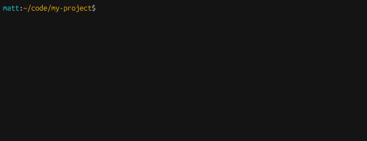
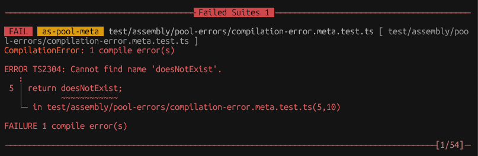
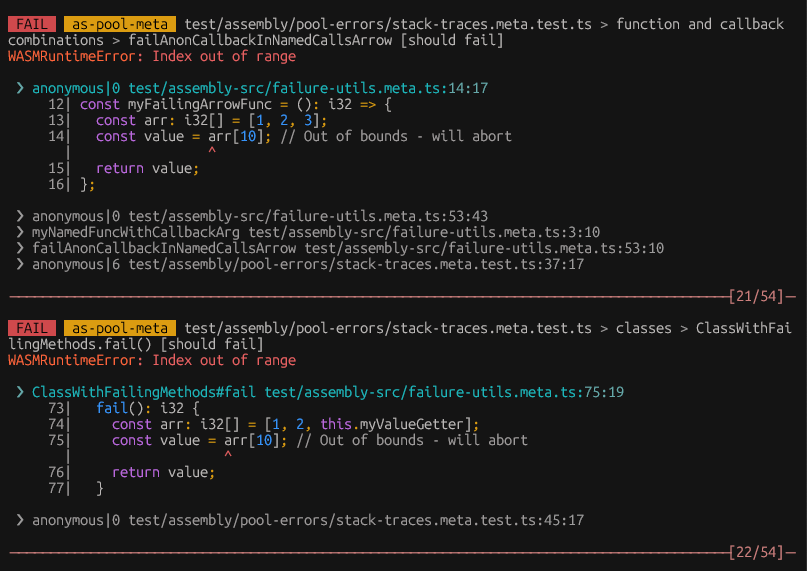
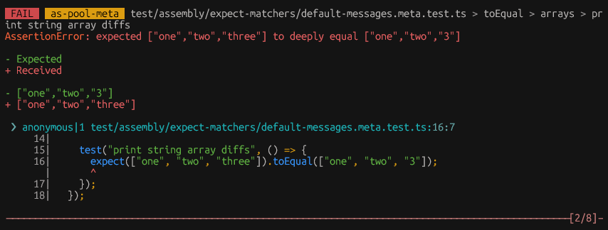
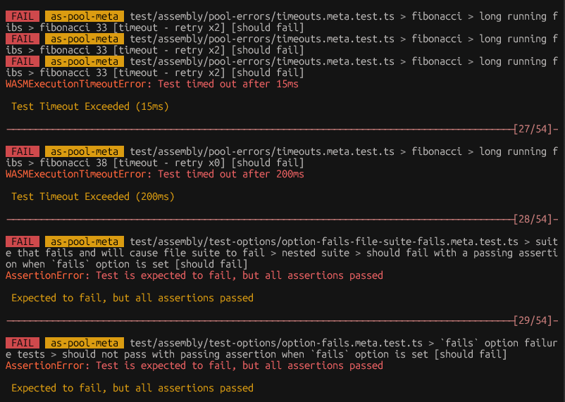
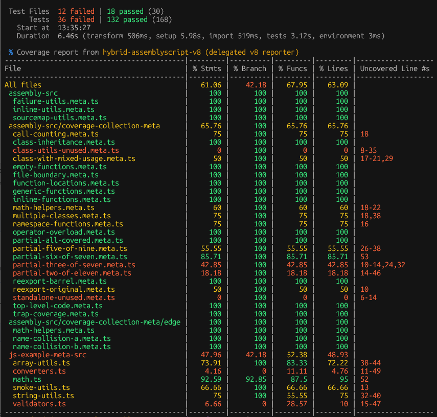
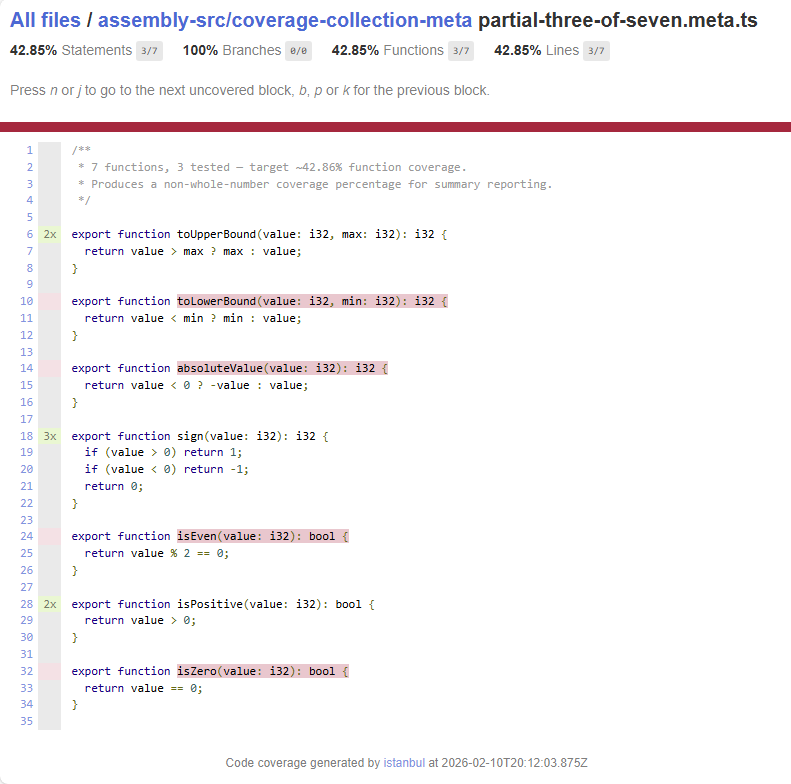
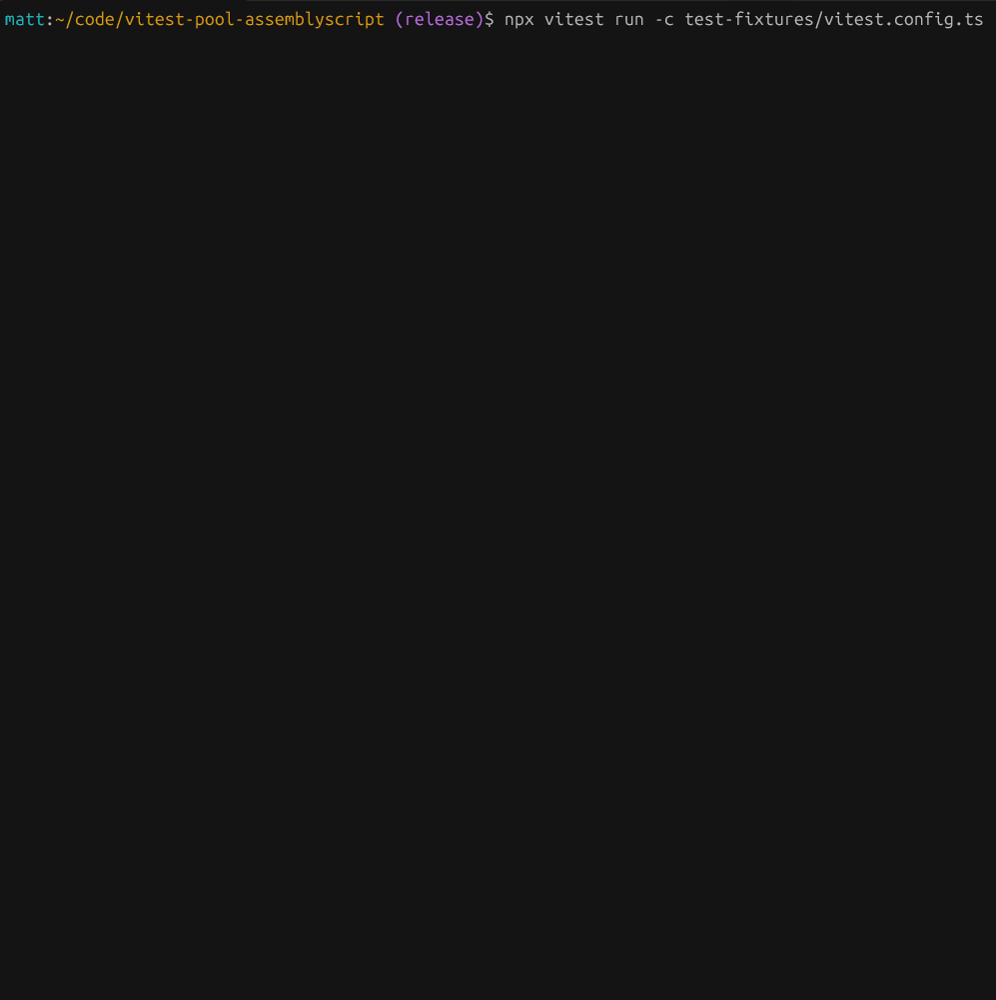

# vitest-pool-assemblyscript

<p align="center">
  
  &nbsp;&nbsp;&#10133;&nbsp;&nbsp;
  <picture>
    <source media="(prefers-color-scheme: dark)" srcset="docs/images/vitest-light.svg">
    <source media="(prefers-color-scheme: light)" srcset="docs/images/vitest-dark.svg">
    
  </picture>
</p>

<p align="center">
  AssemblyScript unit testing in Vitest: Simple, fast, familiar, AS-native.
  <br/>
  <br/>
  <a href="LICENSE"></a>
  <a href="https://github.com/themattspiral/vitest-pool-assemblyscript/actions/workflows/release.yml"></a>
  <a href="https://www.npmjs.com/package/vitest-pool-assemblyscript"></a>
</p>

---

<br/>

<p align="center">
  This <a href="https://vitest.dev/guide/advanced/pool.html">custom pool</a> plugs into <a href="https://vitest.dev">Vitest</a>, giving it the ability to compile AssemblyScript, run isolated WASM tests, and report results with Vitest's reporters. It coexists with your existing JavaScript/TypeScript tests and coverage reporting, and is designed for easy incremental adoption.
</p>

<p align="center">
  Check it out:
  <br/>
  <a href="#quick-start">Quick Start</a> | 
  <a href="#status">Status</a> | 
  <a href="#features">Features</a> |
  <a href="#frequently-asked-questions">Frequently Asked Questions</a>
  <br/>
  <a href="#compatibility">Compatibility</a> | 
  <a href="#current-limitations--roadmap">Roadmap</a> | 
  <a href="#performance">Performance</a> | 
  <a href="#prior-work">Prior Work</a> | 
  <a href="#license">License</a>
</p>
<p align="center">
  Dig in:
  <br/>
  <a href="#writing-tests">Writing Tests</a> |
  <a href="docs/matchers-api.md">Matchers API</a> |
  <a href="docs/configuration-guide.md">Configuration Guide</a> |
  <a href="docs/providing-wasm-imports.md">Providing WASM Imports</a>
</p>
<p align="center">
  Dig deeper:
  <br/>
  <a href="docs/pool-architecture.md">Pool Architecture</a> |
  <a href="docs/coverage-architecture.md">Coverage Architecture</a> |
  <a href="docs/developer-guide.md">Developer Guide</a>
</p>

---

<br/>
<p align="center">
  
</p>

## Quick Start

### 1. Install

```bash
npm install -D vitest vitest-pool-assemblyscript assemblyscript @vitest/coverage-v8
```

### 2. Configure Vitest

Create or update `vitest.config.ts`. See the [Configuration Guide](docs/configuration-guide.md) for all supported vitest options, pool options, coverage configuration, and multi-project setups.

**vitest 5.x & 4.x:**
```typescript
import { defineConfig } from 'vitest/config';
import { createAssemblyScriptPool } from 'vitest-pool-assemblyscript/config';

export default defineConfig({
  test: {
    include: ['test/assembly/**/*.as.test.ts'],
    pool: createAssemblyScriptPool(),
  },
  coverage: {
    provider: 'custom',
    customProviderModule: 'vitest-pool-assemblyscript/coverage-v8',
    assemblyScriptInclude: ['assembly/**/*.ts'],
    enabled: true,
  },
});
```

**vitest 3.x:**
```typescript
import { defineAssemblyScriptConfig } from 'vitest-pool-assemblyscript/v3/config';

export default defineAssemblyScriptConfig({
  test: {
    include: ['test/assembly/**/*.as.test.ts'],
    pool: 'vitest-pool-assemblyscript/v3',
  },
  // coverage configuration mirrors v5/v4
});
```

### 3. Write Some Tests

Create a test file (e.g. `test/assembly/example-file.as.test.ts`):

```typescript
import { test, describe, expect } from "vitest-pool-assemblyscript/assembly";
import { MyClass } from "../assembly/my-class";

test("basic math", () => {
  expect(2 + 2).toBe(4);
});

describe("an example suite", () => {
  test("strings", () => {
    expect("hello").toBe("hello");
    expect("hello").not.toBe("world");
    expect("hello world! 🌎").toContain("🌎");
  });

  test("primitive equality is permissive", () => {
    expect(1).toBe(u64(1));
    expect(f64(42.0)).toBe(u8(42));

    // respects AssemblyScript comparison semantics
    expect(() => {
      expect(f32(42.0)).toBe(42);
    }).toThrowError("float precision is insufficient")
  });

  test("object deep equality", () => {
    const a = new MyClass("hello", 42);
    const b = new MyClass("hello", 42);
    expect(a).toBe(a);     // toBe: reference identity
    expect(a).not.toBe(b);
    expect(a).toEqual(b);  // toEqual: value equality
  });
});
```

### 4. Run

```bash
npx vitest run
```

---

## Status

While relatively young, this project is stable and is being improved every day.

All [listed features](#features) are working and unit-tested.
- [`describe()` and `test()` APIs](#writing-tests): stable, no breaking changes expected
- [`expect()` API](docs/matchers-api.md): stable, no breaking changes expected, main matcher set complete
- Code Coverage / Instrumentation: all coverage types (function, branch, statement, line) stable [across platforms](#compatibility)
- Hybrid Coverage Provider: stable v8 and istanbul JS/TS delegation, side-by-side JS coverage reporting

See Also:
- [Current Limitations & Roadmap](#current-limitations--roadmap)
- [Frequently Asked Questions](#frequently-asked-questions)
- [Report a Bug / Request a Feature](https://github.com/themattspiral/vitest-pool-assemblyscript/issues/new)

---

## Features

### Vitest Integration
- Use familiar `vitest` commands, CLI spec and test filtering, watch mode
- Works with Vitest UI, reporters, and coverage tools
- Project (workspace) config allows coexisting AssemblyScript pools and JavaScript pools
- Hybrid Coverage Provider unifies test reports (`html`, `lcov`, `json`, etc) from multiple pools and delegates JS/TS coverage to either vitest's v8 or istanbul provider
- Supports vitest 3.2.x, 4.x, and 5.x

### Per-Test WASM Isolation
- Each AssemblyScript test **file** is compiled to its own WASM binary
- Each AssemblyScript `test()` **case** in the file suite is executed in a fresh WASM instance with a new WASM memory (reusing only the compiled binary)
- A crashing test only kills the test instance (reporting the runtime error), and the rest of the suite still executes independently
- `toThrowError()` matcher can catch WASM runtime errors (which trap and abort), and can match specific message strings

### Familiar Developer Experience
- Suite and test definition using `describe()` and `test()` in AssemblyScript
- Inline test option configuration for common vitest options: `timeout`, `retry`, `skip`, `only`, `fails`
- Lifecycle hooks `beforeEach` and `afterEach` with vitest runner semantics for ordering, failures, retries, and timeouts
- Assertion matching API based on vitest/jest `expect()` API
  - `.not`, `toBe`, `toBeCloseTo`, `toEqual`, `toStrictEqual`, `toBeGreaterThan`, `toBeGreaterThanOrEqual`, `toBeLessThan`, `toBeLessThanOrEqual`, `toHaveLength`, `toContain`, `toContainEqual`, `toThrowError`, `toBeTruthy`, `toBeFalsy`, `toBeNull`, `toBeNullable`, `toBeNaN`
  - See [Matchers API](docs/matchers-api.md) for details and differences from JavaScript
- Highlighted diffs for assertion and runtime failures, which point to source code
- Source-mapped WASM error stack traces (accurate AssemblyScript source `function file:line:column`)
- AssemblyScript console output captured and provided to vitest for display
- AssemblyScript compiler errors output clearly to the console for debugging
- AssemblyScript code coverage based on WASM execution: function, branch, statement, and line, including any uncovered source
- No AssemblyScript boilerplate patterns needed (`run()`, `endTest()`, `fs.readFile`, `WebAssembly.Instance`, etc)

### Performance & Customization
- Parallel execution thread pools
- In-memory binaries and source maps for minimal file I/O
- Lightweight coverage instrumentation using separate WASM memory (no user memory conflicts, no intermediate JS boundary crossing)
- Coverage for inlined (`@inline`) code
- Enforced hard timeouts for long-running WASM via thread termination, with intelligent resume
- Configurable AssemblyScript compiler options
- Configurable test memory size
- User-provided WASM imports with access to test memory


<table>
  <tr>
    <td align="center">
      <figure>
        <br/>
        <figcaption>AS compiler error</figcaption>
      </figure>
    </td>
    <td align="center">
      <figure>
        <br/>
        <figcaption>Source-mapped, highlighted runtime errors</figcaption>
      </figure>
    </td>
  </tr>
  <tr>
    <td align="center">
      <figure>
        <br/>
        <figcaption>Assertion diff output</figcaption>
      </figure>
    </td>
    <td align="center">
      <figure>
        <br/>
        <figcaption>Timeout and fails outputs</figcaption>
      </figure>
    </td>
  </tr>
  <tr>
    <td align="center">
      <figure>
        <br/>
        <figcaption>AS and JS coverage summary</figcaption>
      </figure>
    </td>
    <td align="center">
      <figure>
        <br/>
        <figcaption>AS coverage HTML report</figcaption>
      </figure>
    </td>
  </tr>
</table>

---

## Frequently Asked Questions

**Q: How does this work?**
<br/>
**A:** Vitest has a [custom pool API](https://vitest.dev/guide/advanced/pool.html) that lets you define the execution environment for the tests it runs (internally, vitest uses its own pools to run JavaScript and TypeScript tests). This custom pool uses the [AssemblyScript compiler](https://www.assemblyscript.org/compiler.html) to compile each test file to WASM, instruments the WASM binary for code coverage, then runs each test in an isolated WASM instance and reports results back to vitest through its standard RPC reporting mechanism.

More detailed information can be found in [Pool Architecture](docs/pool-architecture.md) and [Coverage Architecture](docs/coverage-architecture.md)

**Q: So it is really using vitest?**
<br/>
**A:** Yes! It's a real vitest pool, not a clone of vitest - it hooks directly into the framework, receiving tests to run from vitest and reporting results back. The pool implements its own compilation, test execution, and [matchers in AS](docs/matchers-api.md), designed to mirror the [vitest expect() API](https://vitest.dev/api/expect.html). We don't use vite build integration, but that's the tradeoff of a custom pool - you can bring any execution environment to vitest.

The overall goal is tight vitest experience integration - most CLI commands, reporters, UI, and project configurations should work as you'd expect, and test runner behavior should match the behavior of vitest's JavaScript execution pools: retries, timeouts, skip, only, fails, lifecycle hook ordering and failure semantics, etc.

Some features aren't fully implemented yet, and a few necessarily differ given AssemblyScript's static typing and execution model. See the [configuration guide](docs/configuration-guide.md) and [limitations / roadmap](#current-limitations--roadmap) for specifics.

**Q: Will this work on my machine / in my CI/CD environment?**
<br/>
**A:** Yes! WASM coverage instrumentation requires native binaries, and we ship [prebuilt binaries for most common platforms](#compatibility).

If your platform isn't listed, the npm package installation will fallback to trying to build the native code using a local C++ toolchain (its installation script must be permitted in this case).

**Q: Do you support older versions of AssemblyScript?**
<br/>
**A:** We test against 0.28.20 currently. The project has been developed since version 0.28.9, and is likely to work back to at least this version. Older versions might work but aren't actively tested.

If you're stuck on an older version and run into issues, you're welcome to [open an issue](https://github.com/themattspiral/vitest-pool-assemblyscript/issues/new).

**Q: Is this an official vitest project?**
<br/>
**A:** No, this is a third-party, community project. It's not affiliated with the Vitest team or VoidZero/Cloudflare directly, though we're grateful for their open-source code and intentionally extensible architecture which make projects like this possible, as well as to the [other open-source projects](#prior-work) which provide vital functionality and reference architecture.

**Q: Are you a company? A bot?**
<br/>
**A:** Just [a person](https://github.com/themattspiral)!

I began this as a hobby project to improve my own AssemblyScript testing workflow (and to learn about WASM internals) - And it's grown from there. My intention now is to provide a production-grade developer tool extension library, suitable for any AssemblyScript project pipeline, and in doing so also to contribute something useful and high-quality to the community. Feedback and contributions are welcome.

---

## Compatibility

### Dependencies
| Dependency | Supported Versions |
|---|---|
| Node.js | (20*), 22, 24+ |
| Vitest | 3.2.x, 4.x.x, 5.x.x-beta |
| AssemblyScript | 0.28.9 - 0.28.20+ ([more?](#frequently-asked-questions)) |

***Node 20 Support:** If you don't need code coverage, Node 20 should continue to work for test execution, though it is no longer tested because it reached EOL on April 30, 2026.

>ℹ️ WASM coverage instrumentation is implemented using [WebAssembly multi-memory](https://github.com/WebAssembly/multi-memory) to isolate coverage counters from user test memory. This feature shipped in V8 12.0 / Node 22.

### Platforms

Platforms with prebuilt native binaries for coverage instrumentation:

| | x64 | arm64 |
|---|---|---|
| Linux (glibc) | ✓ | ✓ |
| Linux (musl/Alpine) | ✓ | - |
| macOS | ✓ | ✓ |
| Windows | ✓ | ✓ |

>ℹ️ Platforms without prebuilds will fallback to using an installation script to compile the native component. This must be [explicitly allowed with newest versions of npm (>=11)](https://docs.npmjs.com/cli/v11/commands/npm-approve-scripts).

---

## Writing Tests

Import `test`, `describe`, `expect` from `vitest-pool-assemblyscript/assembly`. These functions are designed to follow the vitest API as closely as possible, so that everything is familiar and easy to reason about.

- `it` is available as an alias for `test`
- `describe` and `test` have inline modifiers to quickly change their run mode (see below)
- `TestOptions` allows per-test inline configuration of additional options (aligned with vitest behavior)

```typescript
import { test, it, describe, expect, TestOptions } from "vitest-pool-assemblyscript/assembly";
import { add } from "../assembly/math.ts";

test("a test", () => {
  expect(1 + 1).toBe(2);
  expect(add(3, 2)).toBe(5);
});

describe("a suite of math operations", () => {
  test("another test", () => {
    expect(3 - 1).toBe(2);
  });

  describe("a nested suite of float operations", () => {
    it("tests something else", () => {
      expect(0.1 + 0.2).toBeCloseTo(0.3);
    });
  });
});
```

### Test Matchers

See [Matchers API Documentation](docs/matchers-api.md) for details on the available `expect()` matchers you can use within your AssemblyScript tests.

>ℹ️ We aim to follow the [vitest/jest `expect()` API](https://vitest.dev/api/expect.html) as closely as possible in surface and behavior, with some necessary differences given AssemblyScript's static-typing. See API docs for details.

### Inline Run Mode Modifiers: `.skip`, `.only`, `.fails`

These modify the way in which tests run in relation to each other, and/or how they report results.

They follow vitest JS-pool behavior.

```typescript
test.skip("not ready yet", () => {
  // test will register it exists, show as skipped
});

test.only("debugging this test", () => {
  // test will run by itself in this file
});

test.fails("conditions are expected to fail, so test will actually pass", () => {
  expect(false).toBeTruthy();
});

test.fails("conditions are expected to fail but do not, so test will actually fail", () => {
  expect(true).toBeTruthy();
});

describe.skip("entire suite skipped", () => { /* ... */ });

describe.only("only this suite runs", () => { /* ... */ });
```

### Inline Test Options

`TestOptions` provides chainable configuration for the vitest behavioral options: `timeout`, `retry`, `skip`, `only`, and `fails`
- While you define them slightly differently in AssemblyScript than JavaScript, their behavior matches the same options in vitest
- Options can be placed before or after the callback
- Suite options (in `describe`) are inherited by nested tests and nested suites

>⚠️ **`retry`**: While this is a standard vitest option, the pool currently only supports a `number`-based retry count, rather than the [enhanced config](https://vitest.dev/config/retry) introduced in vitest 4.1.0

```typescript
// options before callback
test("with timeout", TestOptions.timeout(500), () => { /* ... */ });

// options after callback (retry is number only)
test("with retry", () => { /* ... */ }, TestOptions.retry(3));

// chained options
test("with both", TestOptions.timeout(500).retry(2), () => { /* ... */ });

// suite-level options are inherited by nested tests
describe("slow tests", TestOptions.timeout(1000), () => {
  test("inherits suite timeout", () => { /* ... */ });

  // test-level options override suite options
  test("custom retry", TestOptions.retry(5), () => { /* ... */ });
});

// modifiers and options can be combined
test.fails("expected failure with retry", TestOptions.retry(3), () => {
  expect(false).toBeTruthy();
});
```

### Retry-Aware Tests (`retryCount`)

The test callback optionally receives the current **retry count**: `0` on the first attempt, incrementing by `1` for each retry (so with `TestOptions.retry(n)`, the final attempt receives `n`).

This matters because of WASM isolation: each retry runs in a **fresh WASM instance with fresh memory**, so module-level and global state is re-initialized on every attempt and can't carry information across retries. `retryCount` is supplied by the runner, making it the reliable way to vary behavior per attempt.

```typescript
// Module-level state is re-initialized on every retry attempt, 
// so this counter is ALWAYS 1 (it cannot count attempts)
let attempts: i32 = 0;
test("each retry gets a fresh instance - attempts count fails", TestOptions.retry(2), () => {
  attempts++;
  expect(attempts).toBe(1);
});

// retryCount comes from the runner, so it reflects the attempt number
test("passes only on the final attempt", TestOptions.retry(2), (retryCount: i32) => {
  // retryCount is 0, then 1, then 2
  expect(retryCount).toBeGreaterThanOrEqual(2);
});
```

>ℹ️ The parameter is optional — tests that don't need it use a plain `() => { ... }` callback, exactly as before.

### Lifecycle Hooks (Setup & Teardown)

`beforeEach` and `afterEach` are supported, following vitest runner semantics:

- **Suite-scoped and position-independent**: a hook applies to every test in its enclosing `describe` (or the whole file when registered at the top level), including tests in nested suites, regardless of where in the suite it is registered
- **Ordering**: `beforeEach` chains run outermost-suite-first, in registration order within each suite; `afterEach` chains run innermost-suite-first, in *reverse* registration order within each suite (i.e. the same as vitest's default `sequence.hooks: 'stack'` behavior)
- **Failure handling**: a failing `beforeEach` fails the test; the remaining `beforeEach` chain and the test body are skipped, while the `afterEach` chain still runs. A failing `afterEach` fails the test (even one that passed) and stops the remaining `afterEach` chain
- **Timeouts are the exception to teardown**: a hook or test that exceeds its window terminates the WASM thread, so the `afterEach` chain does *not* run for that attempt
- **Retries**: hooks re-run around every attempt, including each retry
- **Timeouts**: each hook runs in its own timeout window, set per-hook with the optional `timeout` (ms) second argument, or globally with the standard vitest [`hookTimeout` config](docs/configuration-guide.md#supported-vitest-test-options) option
- `expect()` assertions work inside hooks and count toward the test

Because each test runs in its own isolated instance, and because AssemblyScript doesn't support closures, the most common uses for `beforeEach` setup in AS tests are things like:
- directly initializing module-level variables uniformly before every test
- calling module-level functions to modify global behavior
- calling static methods to modify class behavior

```typescript
import { test, describe, expect, beforeEach, afterEach } from "vitest-pool-assemblyscript/assembly";

// Module-level state is how hooks share data with tests
// (tests run isolated and AssemblyScript doesn't support JS-style closures)
let list: i32[] = [];

beforeEach(() => {
  list = [1, 2, 3];  // top-level: applies to every test in the file
});

describe("a suite with hooks", () => {
  beforeEach(() => {
    list.push(4);    // suite-level: runs after the file-level hook
  });

  afterEach(() => {
    expect(list.length).toBeGreaterThan(0);  // assertions work in hooks
  });

  test("hooks ran before this test", () => {
    expect(list).toHaveLength(4);
  });
});

// a long-running hook can set its own timeout window (in ms)
beforeEach(() => { /* ... */ }, 500);
```

>ℹ️ **Per-test isolation applies to hooks too.** Each test runs in a fresh WASM instance, and its hooks run inside that same instance, so module-level state written by `beforeEach` is visible to the test body and to `afterEach`, but nothing carries across / between tests: setup and teardown re-run for every test.

>ℹ️ **Why no `beforeAll`/`afterAll`?** Their purpose in vitest is to run once and share state with every test in the suite. With per-test WASM isolation, cross-test state sharing is physically impossible — providing them would only offer misleading parity (setup that silently re-runs per test). If you have a real use case for them, please [open an issue](https://github.com/themattspiral/vitest-pool-assemblyscript/issues/new).

---

## Current Limitations & Roadmap

### Limitations

These are known limitations which are currently being worked on.

- **Watch mode handles specs only**: Re-runs test files when they are directly changed, but not yet based on changed source files

### Near Future Roadmap

**Epic: Testing DX**
- Watch mode: re-run applicable tests on source file changes
- `describe.for/each` and `test.for/each`
- `expect.soft` to prevent fail-fast behavior (accumulate assertion failures)
- Support enhanced [`retry` config](https://vitest.dev/config/retry) introduced in vitest 4.1.0
- Allow delegating JS/TS to Istanbul coverage provider in addition to v8
- Maybe: Per-file compilation setting override

**Epic: Expand expect matcher API**
- Likely: `toBeOneOf`, `toBeTypeOf`, `toBeInstanceOf`, `toHaveProperty`, `toMatch`

**Epic: Spy and Mock**
- Intend to support spies and mocks in a future release

**✖️ Out of Scope (Currently):**
- JS harness testing for any "generic" precompiled WASM binary
- Compiler & matcher integration with other compile-to-WASM languages (e.g. Rust, C++, etc with Emscripten)
  - I would LOVE to expand this project to cover additional cases, supporting pluggable compilers, AST parsing, and matchers for different WASM ecosystems and toolchains
  - This is not in scope now because of time and effort
  - If you want to pay me to work on this, please [get in touch](https://github.com/themattspiral)!

---

## Performance

Effort has been made to get the pool to compile and execute as quickly as possible. Some optimizations that have been most useful:
- In-memory only AssemblyScript compiled binaries and source maps to eliminate intermediate disk I/O
- Separate compile and test execution thread pools, worker thread entry points, and runners (smaller files = quicker startup and thread respawn after test timeouts)
- Compile thread count tuned to take advantage of significant Node V8 engine warmup time savings on consecutive AssemblyScript compilations (this is an ongoing investigation)
- Enforced hard timeouts for long-running WASM tests via thread termination, with intelligent resume

As such, it is capable of compiling dozens of test files comprising hundreds of tests in a few seconds. While there's still a compilation delay, it should rival / exceed performance of other AssemblyScript unit test runners:

<p align="center">
  
</p>

---

## Prior Work

There are several core pieces of software without which this project would not be possible.

- This project makes direct use of the [AssemblyScript language](https://www.assemblyscript.org) and its fantastic [compiler](https://www.assemblyscript.org/compiler.html). AS is a joy to work with when it comes to WASM because it's so familiar to everyday TypeScript usage.
- The key component that allows us to perform WASM instrumentation is [Binaryen](https://github.com/WebAssembly/binaryen), a C++ toolchain infrastructure library for WebAssembly. We started by using the fantastic [binaryen.js](https://github.com/AssemblyScript/binaryen.js/) - a JS port also from the folks behind AssemblyScript, and eventually migrated to the native library for some advanced source-map regeneration features.
- Thanks to the [Vitest team](https://github.com/vitest-dev) for creating the framework in the first place and making it extensible for different runtimes. Their internal pools were used as reference throughout development.
- Thanks to [`@cloudflare/vitest-pool-workers`](https://github.com/cloudflare/workers-sdk/tree/main/packages/vitest-pool-workers) for providing the leading example of a 3rd party vitest custom pool out in the wild.
- Particular gratitude is also owed to [assemblyscript-unittest-framework](https://github.com/wasm-ecosystem/assemblyscript-unittest-framework) for inspiring our test discovery and instrumentation expression-walking approaches.

---

## License

Licensed under the [MIT License](LICENSE)

Portions of this software have been derived from third-party works which are licenced under different terms. These uses have been noted and are accompanied by their respective licenses in the [project license](LICENSE) and/or in applicable source code.
